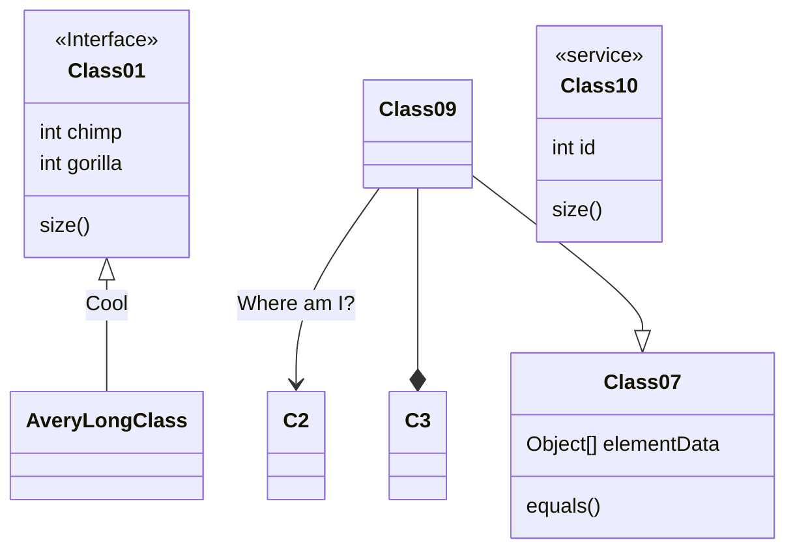

# Architecture design

## Strength of this architecture

- Building the router prevents clear structure with DI (dependency injection).
   1. First, main.go calls NewRouter.
   2. Next, NewRouter() calls setup() which set up all the necessary functions and keys.
      1. setup() has three steps
      2. It establishes connection with external devices. Here also gets apikey from .env file to establish connections.
      3. Then, it stores all the created connection/client to newRegister.
      4. Finally, it sets up all the connections to one controller that contains everything we need.
      5. With this way, service layer doesn't have to depend on outer layer which supports "dependency inversion" from SOLID principle.
   3. Then, there is an struct that contains everything, so next it resolves CORS issues.
   4. Lastly, it adds the necessary API paths and return to main.

 

- Supporting "Interface Segregation Principle" and "Open-Closed Principle" from SOLID principle.
   1. Each layer (Controller, Service, External Devices handling) has interface.
   2. Especially External Device handling layer is capable of adding new external devices such as Sendgrid and PayPal.
      1. It can be added to DataHandler and became easily accessible to business logic.

 

- Using [mockgen](https://github.com/golang/mock) to complete unit test
  1. To complete unit test with a function that uses another function, there is a need to create mock function for it.
  2. It uses mockgen to auto-generate mock functions and interface, and enable to conduct unit test one by one.

Flow:
